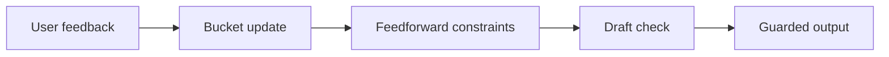

# ILC Output Guard Skill

Portable skill for building an iterative-learning output guard around recurring writing, formatting, explanation, or delivery failures.

## Who This Is For

| Use this when you... | Use something else when you... |
| --- | --- |
| need feedback buckets for repeated output failures | only need a one-time paragraph rewrite |
| want feedforward constraints before drafting | only want grammar checking |
| need fail-closed checks before sending a deliverable | want to store private memory in a public repo |

## Why This Exists

- Keeps feedback as a closed loop instead of scattered reminders.
- Separates generic guard mechanics from private live state.
- Supports historical replay without double-counting duplicates.

## What Ships

| Component | Role |
| --- | --- |
| [`ilc-output-guard`](./ilc-output-guard) | installable Codex App skill package |
| [`ilc-output-guard/agents/openai.yaml`](./ilc-output-guard/agents/openai.yaml) | Codex App interface metadata |
| [`ilc-output-guard/references`](./ilc-output-guard/references) | bundled public reference material |
| [`ilc-output-guard/scripts`](./ilc-output-guard/scripts) | bundled helper scripts |
| [`ilc-output-guard/tests`](./ilc-output-guard/tests) | package-level tests |
| [`ilc-output-guard/test-prompts.json`](./ilc-output-guard/test-prompts.json) | trigger and non-trigger examples |
| [`CHANGELOG.md`](./CHANGELOG.md) | release history |
| [`LICENSE`](./LICENSE) | license |

## Install / Use

### Codex App

- Install the skill from this repo path: `ilc-output-guard`
- GitHub install target:
  - repo: `Mingdao007/ilc-output-guard-skill`
  - path: `ilc-output-guard`
- Restart `Codex App` after installation so the new skill is discovered.

## Workflow

## Coverage

- bucketized output-feedback memory
- feedforward guidance before drafting
- deterministic draft checks before sending
- feedback dedupe for historical replay or repeated user corrections
- portable state files chosen by the caller

## Expected Result / Verification

| Check | Expected result |
| --- | --- |
| Install target | `ilc-output-guard` |
| GitHub target | `Mingdao007/ilc-output-guard-skill` with path `ilc-output-guard` |
| Skill entrypoint | `ilc-output-guard/SKILL.md` exists |
| Trigger examples | `ilc-output-guard/test-prompts.json` |
| Privacy check | public package contains no private local paths or live user state |

## Trigger Examples

- `Build an ILC-based guard for this output style.`
- `Remember this formatting failure and tighten future drafts.`
- `Run output guard preflight before sending this explanation.`
- `Replay old feedback without double-counting the same event.`

## Non-Trigger Examples

- `Rewrite this paragraph once.`
- `Check grammar only.`
- `Store private memory in a public repo.`

## Privacy Boundary

This public repository keeps the workflow generic and reusable.

- No private session logs, personal memory, or live ILC state are included.
- State paths are caller-provided or default to the current working directory.
- Bucket names are generic and should be adapted by the installing agent.

## Repository Layout

| Path | Purpose |
| --- | --- |
| [`ilc-output-guard`](./ilc-output-guard) | installable Codex App skill package |
| [`ilc-output-guard/agents/openai.yaml`](./ilc-output-guard/agents/openai.yaml) | Codex App interface metadata |
| [`ilc-output-guard/references`](./ilc-output-guard/references) | bundled public reference material |
| [`ilc-output-guard/scripts`](./ilc-output-guard/scripts) | bundled helper scripts |
| [`ilc-output-guard/tests`](./ilc-output-guard/tests) | package-level tests |
| [`ilc-output-guard/test-prompts.json`](./ilc-output-guard/test-prompts.json) | trigger and non-trigger examples |
| [`CHANGELOG.md`](./CHANGELOG.md) | release history |
| [`LICENSE`](./LICENSE) | license |

Chinese:

- [README.zh-CN.md](./README.zh-CN.md)
