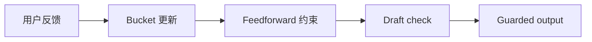

# ILC Output Guard Skill

可移植的 ILC output guard skill，用于把重复出现的写作、格式、解释或交付失败转化为闭环反馈。

## 适合谁

| 适合使用 | 不适合使用 |
| --- | --- |
| 需要为重复 output failure 建立 feedback bucket | 只需要一次性改写某段文字 |
| 希望 draft 前有 feedforward constraint | 只想做 grammar check |
| 需要发送前 fail-closed check | 想把 private memory 存进公开 repo |

## 为什么需要它

- 把 feedback 保持为闭环，而不是零散提醒。
- 把通用 guard 机制和私人 live state 分开。
- 支持历史 replay，同时避免重复计数。

## 包含内容

| Component | 作用 |
| --- | --- |
| [`ilc-output-guard`](./ilc-output-guard) | 可安装的 Codex App skill package |
| [`ilc-output-guard/agents/openai.yaml`](./ilc-output-guard/agents/openai.yaml) | Codex App 界面 metadata |
| [`ilc-output-guard/references`](./ilc-output-guard/references) | 随包发布的公开 reference material |
| [`ilc-output-guard/scripts`](./ilc-output-guard/scripts) | 随包发布的 helper scripts |
| [`ilc-output-guard/tests`](./ilc-output-guard/tests) | package-level tests |
| [`ilc-output-guard/test-prompts.json`](./ilc-output-guard/test-prompts.json) | trigger / non-trigger 示例 |
| [`CHANGELOG.md`](./CHANGELOG.md) | release history |
| [`LICENSE`](./LICENSE) | license |

## 安装 / 使用

### Codex App

- 从本 repo 的这个路径安装 skill：`ilc-output-guard`
- GitHub install target:
  - repo: `Mingdao007/ilc-output-guard-skill`
  - path: `ilc-output-guard`
- 安装后重启 `Codex App`，让新 skill 被重新发现。

## 工作流

## 覆盖范围

- bucketized output-feedback memory
- draft 前的 feedforward guidance
- 发送前 deterministic draft checks
- 历史 replay 或重复 user corrections 的 feedback dedupe
- 由 caller 选择 portable state files

## 预期结果 / 验证

| 检查项 | 预期结果 |
| --- | --- |
| 安装路径 | `ilc-output-guard` |
| GitHub target | `Mingdao007/ilc-output-guard-skill`，path 为 `ilc-output-guard` |
| Skill 入口 | 存在 `ilc-output-guard/SKILL.md` |
| 触发样例 | `ilc-output-guard/test-prompts.json` |
| 隐私检查 | 公开包不包含私人本机路径或 live user state |

## 触发示例

- `Build an ILC-based guard for this output style.`
- `Remember this formatting failure and tighten future drafts.`
- `Run output guard preflight before sending this explanation.`
- `Replay old feedback without double-counting the same event.`

## 不应触发

- `Rewrite this paragraph once.`
- `Check grammar only.`
- `Store private memory in a public repo.`

## 隐私边界

这个公开仓库只保留通用、可复用的 workflow。

- 不包含 private session logs、personal memory 或 live ILC state。
- state path 由 caller 提供，或默认使用当前工作目录。
- bucket name 保持通用，可由安装方自行调整。

## 仓库结构

| 路径 | 作用 |
| --- | --- |
| [`ilc-output-guard`](./ilc-output-guard) | 可安装的 Codex App skill package |
| [`ilc-output-guard/agents/openai.yaml`](./ilc-output-guard/agents/openai.yaml) | Codex App 界面 metadata |
| [`ilc-output-guard/references`](./ilc-output-guard/references) | 随包发布的公开 reference material |
| [`ilc-output-guard/scripts`](./ilc-output-guard/scripts) | 随包发布的 helper scripts |
| [`ilc-output-guard/tests`](./ilc-output-guard/tests) | package-level tests |
| [`ilc-output-guard/test-prompts.json`](./ilc-output-guard/test-prompts.json) | trigger / non-trigger 示例 |
| [`CHANGELOG.md`](./CHANGELOG.md) | release history |
| [`LICENSE`](./LICENSE) | license |

English:

- [README.md](./README.md)
